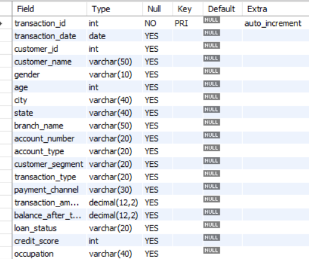
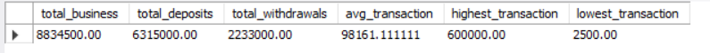
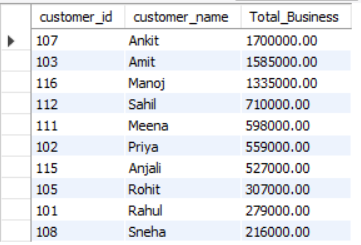
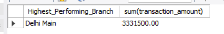
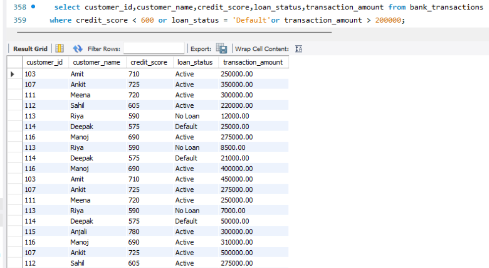

# Bank Customer Transaction & Risk Analytics using MySQL

## Project Overview

This project analyzes banking transaction data from a fictional bank using MySQL to understand transaction patterns, business performance, customer behavior, branch performance, and financial risk indicators.

The project contains 100 SQL-based analytical questions covering basic reporting, business KPIs, customer analytics, branch performance, fraud/risk analysis, and executive-level reporting.

## Business Objectives

- Analyze overall transaction and business performance
- Calculate key banking KPIs
- Understand customer transaction behavior
- Analyze customer segments and account types
- Compare branch-level performance
- Identify high-value and potentially risky transactions
- Analyze credit scores and loan default status
- Identify customers with repeated ATM withdrawals and UPI payments
- Generate an executive-level KPI report

## Dataset

- 60 sample banking transactions
- 20 unique customers
- Main table: `bank_transactions`

### Main Data Fields

`transaction_id` • `transaction_date` • `customer_id` • `customer_name` • `gender` • `age` • `city` • `state` • `branch_name` • `account_type` • `customer_segment` • `transaction_type` • `payment_channel` • `transaction_amount` • `balance_after_transaction` • `loan_status` • `credit_score` • `occupation`

## SQL Concepts Used

`SELECT` • `WHERE` • `DISTINCT` • `ORDER BY` • `LIMIT` • `LIKE` • `BETWEEN` • `IN` • `COUNT()` • `COUNT(DISTINCT)` • `SUM()` • `AVG()` • `MAX()` • `MIN()` • `GROUP BY` • `HAVING` • `CASE` • `MONTH()` • `YEAR()` • `DAYOFWEEK()`

## Analysis Modules

### Module 1 — Basic Transaction Reporting
**Questions Q1–Q20**

- Customer and transaction filtering
- City, branch and account analysis
- Transaction type and payment channel analysis
- Date-based filtering
- Sorting and transaction counts

### Module 2 — Business KPI Analysis
**Questions Q21–Q40**

- Total business
- Total deposits and withdrawals
- Average transaction value
- Highest and lowest transactions
- Branch-wise, city-wise and state-wise business
- Account-type and customer-segment analysis
- Monthly, quarterly and yearly business trends

### Module 3 — Customer Analytics
**Questions Q41–Q60**

- Top customers by total business
- Customer transaction frequency
- High-business customers
- Credit score analysis
- Age and customer segment analysis
- City and state customer distribution
- Payment-channel behavior

### Module 4 — Branch Performance
**Questions Q61–Q75**

- Highest-performing branches
- Branch-wise deposits and withdrawals
- Average transaction value
- Customer count
- Average balance
- Credit score analysis
- Premium customer analysis
- Cash and digital transaction analysis
- Customer segment, gender and occupation analysis

### Module 5 — Fraud & Risk Analysis
**Questions Q76–Q90**

- High-value transactions
- Large cash deposits and withdrawals
- Repeated high-value transactions
- Low-balance customers
- Low credit-score customers
- Weekend transactions
- Repeated ATM withdrawals
- Repeated UPI payments
- Loan default analysis
- High-risk customer reporting

### Module 6 — Executive Dashboard KPIs
**Questions Q91–Q100**

- Total customers
- Total transactions
- Total business
- Total deposits
- Total withdrawals
- Average transaction
- Average balance
- Highest transaction
- Best-performing branch
- Best customer

## Database Schema

## Business KPI Analysis

## Customer Analysis

## Branch Performance

## Fraud & Risk Analysis

## KPI Summary

| KPI | Description |
| --- | --- |
| Total Customers | Count of unique customers |
| Total Transactions | Total number of transaction records |
| Total Business | Sum of transaction amounts |
| Total Deposits | Total amount of deposit transactions |
| Total Withdrawals | Total amount of withdrawal transactions |
| Average Transaction | Average transaction amount |
| Average Balance | Average balance after transaction |
| Highest Transaction | Maximum transaction amount |
| Best Branch | Branch with the highest total business |
| Best Customer | Customer with the highest total business |

## Risk Analysis Definition

For the high-risk customer report, the project combines selected risk indicators used in the Fraud & Risk module:

- Credit score below 600
- Loan status as `Default`
- Transaction amount above ₹2,00,000

These conditions are used as an analytical rule for the project report. The assignment does not provide one single formal definition for `High-Risk Customer`.

## Key Analysis Areas

**Business Performance:** Total business, deposits, withdrawals, average transaction and transaction trends

**Customer Analytics:** Customer business, transaction frequency, age groups, segments, credit scores and payment behavior

**Branch Performance:** Branch-wise business, customer counts, balances, transaction channels and customer segments

**Risk Analytics:** High-value transactions, low credit scores, default loans and repeated transaction patterns

## How to Run

1. Open MySQL Workbench.
2. Run `bank_customer_risk_analysis.sql`.
3. Create the database and `bank_transactions` table.
4. Insert the sample banking transaction data.
5. Execute the SQL analysis queries.
6. Review the results for each analysis module.

## Skills Demonstrated

**MySQL | SQL | Data Analysis | Business Analysis | Banking Analytics | KPI Reporting | Customer Analytics | Risk Analysis | Aggregation | Data Filtering**
