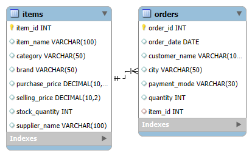
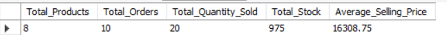
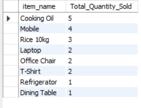
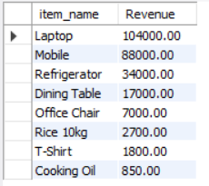

# SmartMart Retail Order Analysis | MySQL

## About the Project

This project focuses on analyzing product and order data for SmartMart, a fictional retail business. I used MySQL to explore product sales, customer orders, supplier performance, inventory levels, and revenue.

The project includes **50 business questions and 5 bonus questions**, covering basic SQL queries through business analysis.

## Database

- **Database:** `RetailAnalyticsDB`
- **Tables:** `items` and `orders`
- **Relationship:** `items.item_id` is connected to `orders.item_id` through a primary key and foreign key relationship.
- **Sample Data:** 8 products and 10 orders

### Database Schema

## What I Analyzed

- **Product Sales:** Identified top-selling and least-selling products.
- **Category and Supplier Performance:** Compared sales quantities across categories, brands, and suppliers.
- **Customer Orders:** Analyzed orders by city and payment mode.
- **Inventory:** Identified low-stock products and products that had never been ordered.
- **Business KPIs:** Calculated total products, orders, quantity sold, available stock, and average selling price.
- **Revenue Analysis:** Calculated product-wise revenue and explored category-wise and supplier-wise revenue.

## Key Results

The following results are based on the project's sample data.

| Metric | Result |
|---|---:|
| Total Products | 8 |
| Total Orders | 10 |
| Total Quantity Sold | 20 units |
| Total Stock Available | 975 units |
| Average Selling Price | ₹16,308.75 |
| Highest-Quantity Category | Grocery — 8 units |
| Highest-Revenue Product | Laptop — ₹1,04,000 |

### KPI Report

### Product Sales Analysis

This analysis compares the quantity sold for each product to highlight sales performance.

### Revenue Analysis

Revenue is estimated by multiplying the ordered quantity by the product's listed selling price.

## SQL Concepts Practiced

`SELECT` · `WHERE` · `DISTINCT` · `ORDER BY` · `LIMIT` · `JOIN` · `GROUP BY` · `COUNT()` · `SUM()` · `AVG()` · `MAX()` · `MIN()` · Subqueries · Primary and Foreign Keys

## Tools Used

- MySQL
- MySQL Workbench

## How to Run

1. Open `smartmart_order_analysis.sql` in MySQL Workbench.
2. Create the database and tables.
3. Insert the sample data.
4. Execute the queries and review the results.

## Note

This project uses sample data for learning and portfolio purposes. Revenue estimates use listed selling prices and ordered quantities; discounts, taxes, and returns are not included.
